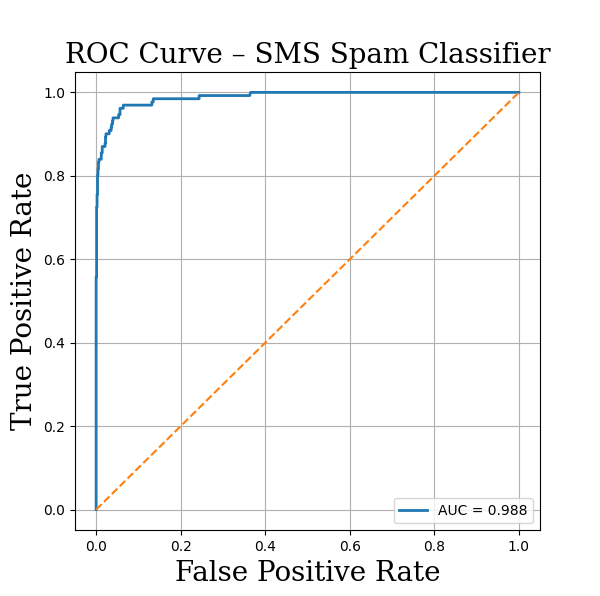

# Python-PostgreSQL-XGBoost-Spam-Message-Prediction

A receiver operating characteristic (ROC) curve that illustrates the accuracy of the XGBoost model used to predict whether an SMS is spam.

# 1. Objective

# 2. Requirements

# 3. ETL Process

# 4. PostgreSQL Integration

# 5. Iterative Approach

# 5.1 Random Forest Classifier 

# 5.2 Logistic Regression

# 5.3 XGBoost Model

# 6. Insights

